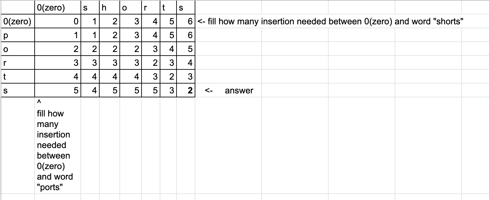

### Algorithmic Design and Techniques

*Asymptotic analysis* helps to measure the efficiency of the algirithms, which does not depend on particular hardware of programming language. 

# Linear search:

Let's say in the sorted array [1, 2, 3, 4, 5] you need to guess the number that was chosen by computer os someone else from the above array. The linear search implementation will be to go through each elem one by one until we guess the number. 

# Binary search: 

Same task as above, but in binary search we pick random number and depending if is too high or too low we choose which direction we need to go through to guess the right number. Thus binary search works repeatedly dividing in half the portion of hte list that could contain an item, until you've narrowed down the possible location to one. 

The running time of bimary search is always O(log 2n). 

Growth rate: 
growth_rate.png
(add image file growth_rate.png)

# Selection sort: 

We are using sroting in order to sort elems in the list in asc or desc order.
A key step in sorting algo is swapping, where we are swapping elems between each other and hence sorting them. 

Pseudocode for selection sort:
1. Find the smallest card. Swap it with the first card.
2. Find the second-smallest card. Swap it with the second card.
3. Find the third-smallest card. Swap it with the third card.
4. Repeat finding the next-smallest card, and swapping it into the correct position until the array is sorted.

# Insertion sort:

Loop over the list starting with the index 1 and insert an elem in the correct place in the sorted subarray to the left of that position. The main step in insertion sort is making space in an array to put the current value, which is stored in the variable key.

Pseudocode:
1. Loop through the array starting from 1 index
2. Set the key as ith elem of the list 
3. Loop through the second list starting from index - 1
4. Check if the elem is more then key -> duplicate elem 
5. Set jth + 1 elem to the key

# Recursion:
The way to design an algorithm to solve a problem by solving a smaller instance of a problem, unless the problem is so small that we can just solve it directly. 
To make recursive implemetation more efficient we can use *memoization*. Memoization (a form of caching) remembers the result of a function call with particular inputs in a lookup table (the "memo") and returns that result when the function is called again with the same inputs.

# Merge algorithm:
Merge sort is an algo paradigm based on recursion. This paradigm, **divide and conquer**, breaks a problem into subproblems that are similar to the original problem, recursively solves the subproblems, and finally combines the solutions to the subproblems to solve the original problem. Because divide-and-conquer solves subproblems recursively, each subproblem must be smaller than the original problem, and there must be a base case for subproblems. 

Common scenario of solving the problem: 
1. **Divide** the problem into a number of subproblems that are smaller instances of the same problem.
2. **Conquer** the subproblems by solving them recursively. If they are small enough, solve the subproblems as base cases.
3. **Combine** the solutions to the subproblems into the solution for the original problem.

Merge algorithm does not work in place. It creates copy of an array in order to sort it. When memory is important - merge algorithm will not suite.

(add divide and conquer image)

# Quick sort:
Quick sort uses divide and conquer strategy and it's a recursive algorithm. In merge sort, the divide step does hardly anything, and all the real work happens in the combine step. Quicksort is the opposite: all the real work happens in the divide step. In fact, the combine step in quicksort does absolutely nothing. **Quick sort works in place.** In practice, quicksort outperforms merge sort, and it significantly outperforms selection sort and insertion sort even though it's running time On2.

Quick sort constits of the following steps:
1. **Divide** by choosing any element in the subarray array[p..r]. Call this element the pivot.(Good practice to choose righmost elem). Elems that are less then the pivot go to the left, that are more them the pivot go to the right. It's called **partitioning.** 
2. **Conquer** by recursevely sorting subarrays.
3. **Combine** by doing nothing. Once the conquer step recursively sorts, we are done.

Faster quick sort algo implementation: 

# Graphs:
Graphs consist of vertices(vertex for one) and lines connecting two vertices. Graph called **undirected** when vertices connected with edges both ways. **Directed** graphs when relations don't necessarily go both ways. 
In an undirected graph, an edge between two vertices, is **incident** on the two vertices, and we say that the vertices connected by an edge are adjacent or neighbors. The number of edges incident on a vertex is the degree of the vertex. Path between two vertices with the fewest edges called **shortest path**.
When a path goes from a particular vertex back to itself, that's a **cycle**.
The general term we use for a number that we put on an edge is its **weight**, and a graph whose edges have weights is a **weighted graph**. 
Edges, shown with arrows, are **directed**, and we have a **directed graph**. Particular directed graph might not cycles; we call such a graph a **directed acyclic graph**, or **dag**.
The number of edges leaving a vertex is its **out-degree**, and the number of edges entering is the **in-degree**.

One simple way to represent a graph is just a list, or array, of |E|∣E∣vertical bar, E, vertical bar edges, which we call an **edge list**.  Example: `[[0, 6], [3, 5], [7, 8]]`

**Breadth-first sarch** also known as **BFS**, finds shortest paths from a given source vertex to all other vertices, in terms of the number of edges in the paths.
**BFS** assigns two values to each ertex *v*:
- a distance. giving the min number of edges in any path form the source vertex to vertex v
- the predessor vertex of v along some shortest path from the source vertex. The source vertex's predecessor is some special value, such as null, indicating that it has no predecessor.

To keep track of which vertices have already been visited but have not yet been visited from we use a **queue**, which is a data structure that allows us to insert and remove items, where the item removed is always the one that has been in the queue the longest. We call this behavior first in, first out. 

A queue has three operations:
- enqueue(obj) inserts an object into the queue.
- dequeue() removes from the queue the object that has been in it the longest, returning this object.
- isEmpty() returns true if the queue currently contains no objects, and false if the queue contains at least one object.

**Dynamic programming**

